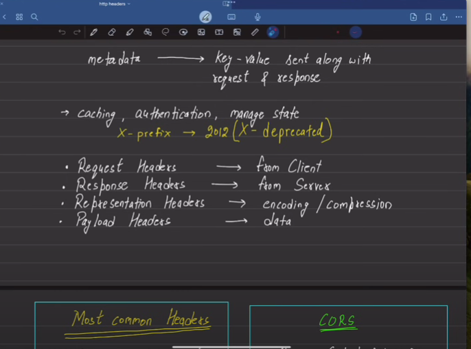
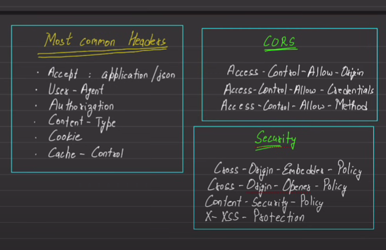
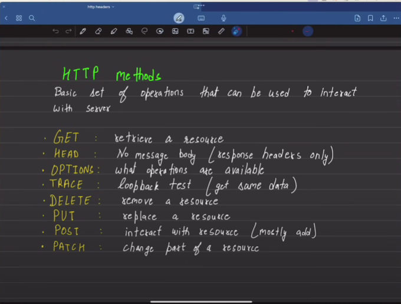
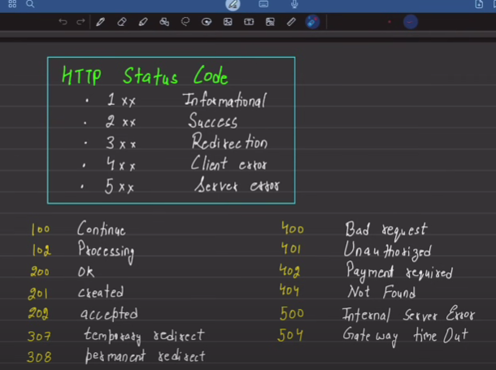

environment variable system se uthay jaata hai taaki ye secure rhe ye file se nhi uthaya jaata
# dev dependency vo dependency hoti hai jo development k time pr use krenge production k time p nhi leke jaana hai

# nodemon : will reload everything in the source file automatically 

#The process object in Node. js is a global object that can be accessed inside any module without requiring it. 

# we will use app.use when we have middleware or we have any config setting

# bcrypt : is a lib which helps us to hash passwords

# Hooks:
Async hooks in Node. js are a way to keep track of asynchronous operations in a Node. js application

# jwt
jwt is a bearer token means ye token jiske bhi pass hoga mai use data bhej dungi 

# cloudinary : ye user se file leke apne server pe daalti hai
# multer ka use krke hum file ko temp apne local server pe rkh denge
then cloudinary ka use krke hum local server se file ko leke server pe daal denge

//hum direct bhi kr sakte hai lekin production base pe ye practice hoti hai ki phle mutter ka use krke hu ka

# What are HTTP headers??
metadata : key-value sent along with request and response
## working of headers:
caching,authentication,manage state 

